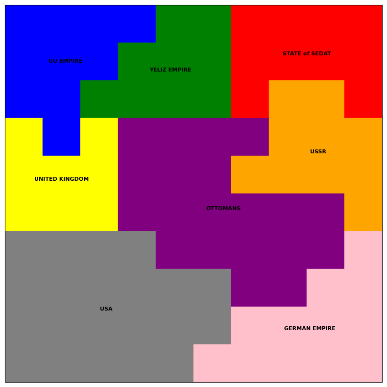
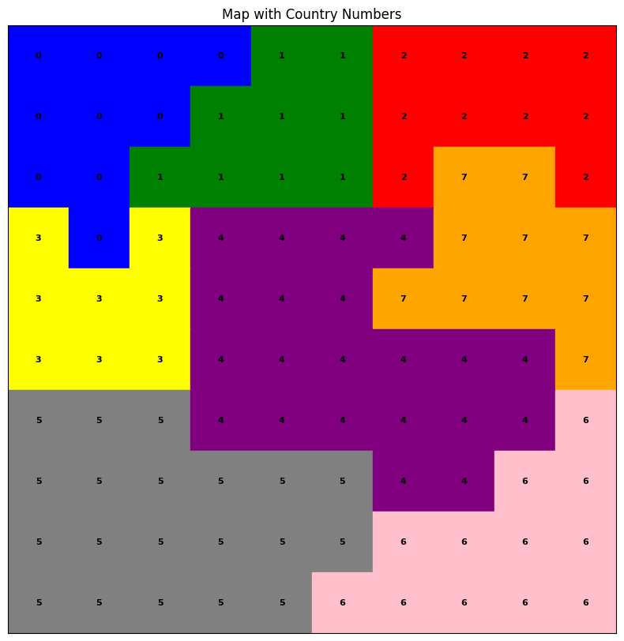
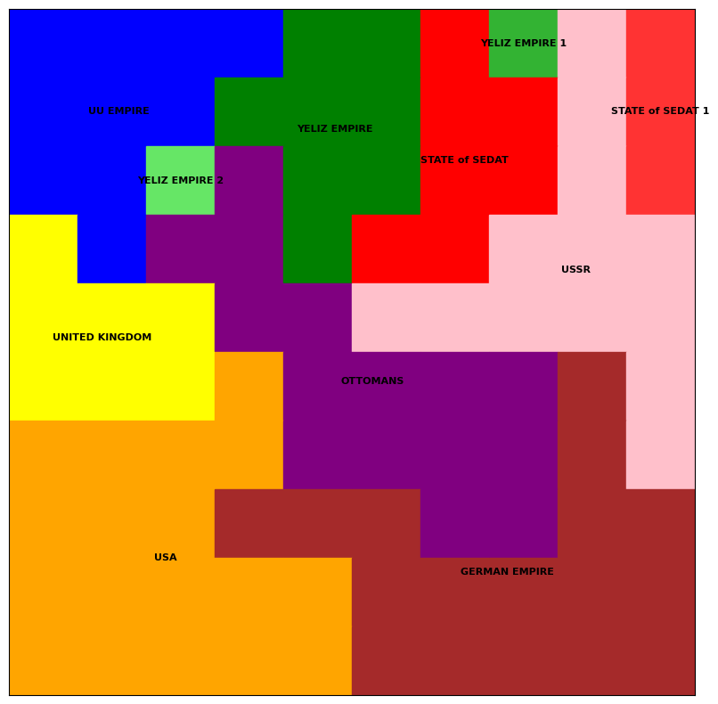
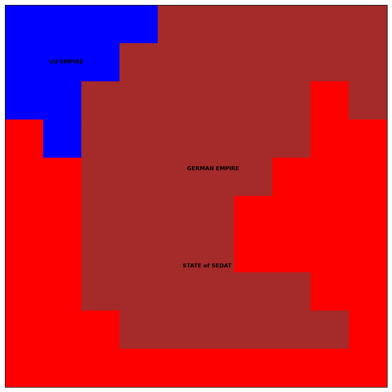

# Map Game 🗺️

An interactive map-based strategy game where countries battle, expand, and split in real-time!

## 🎮 Game Demo

### Initial Map


### Countries with Numbers


### Attack and Split


### Named Countries After Split


### After 10,000 Random Matches


Watch as countries randomly attack their neighbors and territories split when conquered!

## 🚀 How to Run

1. **Clone this repository:**
```bash
git clone https://github.com/sedatkacar56/Map_Game.git
cd Map_Game
```

2. **Create virtual environment:**
```bash
python -m venv Map_Game
Map_Game\Scripts\activate  # Windows
# source Map_Game/bin/activate  # Mac/Linux
```

3. **Install requirements:**
```bash
pip install -r requirements.txt
```

4. **Run Jupyter:**
```bash
jupyter notebook
```

5. **Open `map_game.ipynb` and run all cells!**

## 📖 How It Works

- Countries are randomly placed on a grid
- Each turn, a random country attacks a neighboring country
- Conquered territories may split into smaller countries
- Different colors represent different nations
- Stable countries (like neutral zones) don't participate in combat

## 🛠️ Customize

Edit these parameters in the notebook:
- `num_countries`: Number of starting countries
- `num_turns`: How many turns to simulate  
- `grid_size`: Size of the map (default: 100x100)
- `stable_countries`: Set of countries that cannot attack or be attacked

## 🎲 Features

- ✅ Random map generation
- ✅ Turn-based combat system
- ✅ Country splitting mechanics
- ✅ Color-coded visualization
- ✅ Named countries support
- ✅ Real-time map updates

Enjoy playing! 🗺️